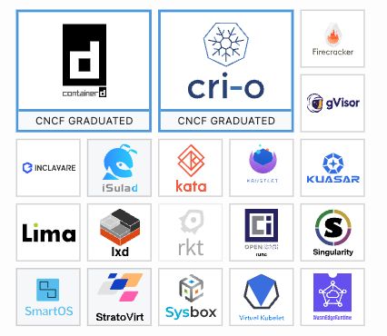

### Container runtimes

* A container runtime is a software component responsible for executing and managing containerized applocations on a host operating system. e.g. runC, containerd, rkt, cri-o.

* Interesting fact, Kubernetes doesn’t know how to run containers it relies on the container runtime for running and managing containers on a host.

* Docker utilizes [runC](https://github.com/opencontainers/runc) as a lightweight, portable container runtime under the hood, and [containerd](https://containerd.io/) to provides a runtime environment for Docker containers.
Subsequently donated runC to [OCI](https://opencontainers.org/about/overview/) as a reference implementation, and containerd to [CNCF](https://www.cncf.io/projects/containerd/).

* runC includes all of the plumbing code used by Docker to interact with system features related to containers. Check the container runtime used by Docker: `docker system info --format "{{ .DefaultRuntime }}"`{{exec}}